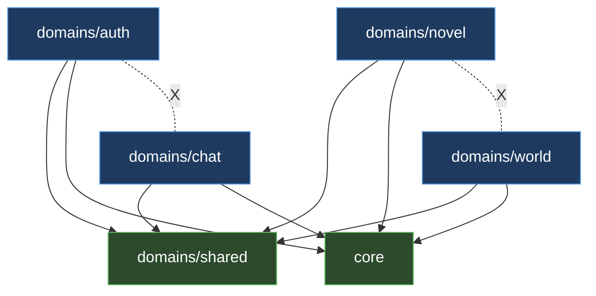

# ARCHITECTURE

StoryWriter Studio는 모노레포다. 백엔드 `apps/api/`는 FastAPI + DDD 스타일 도메인 구조, 프론트엔드 `apps/web/`는 React 19 + TanStack Router 파일 기반 라우팅으로 구성된다. 프론트엔드는 HeyAPI가 백엔드 OpenAPI 스펙으로부터 생성한 SDK(`apps/web/src/generated/`)를 통해 백엔드를 호출한다.

## Backend layered architecture

백엔드는 도메인별로 동일한 4계층 구조를 따른다. 요청은 Router에서 검증·직렬화되고, Service에서 비즈니스 로직이 실행되며, Repository가 모든 DB I/O를 담당하고, Models/Schemas가 영속 모델과 데이터 계약을 정의한다.

- **Router** (`apps/api/src/domains/<name>/router/<name>_router.py`) — FastAPI `APIRouter`. 요청 검증, Service 호출, 응답 직렬화. `AppError`를 잡아 `_app_error_to_http()`로 HTTP 예외로 변환한다.
- **Service** (`apps/api/src/domains/<name>/service/<name>_service.py`) — 비즈니스 로직. `AppError` 서브클래스를 raise하고 `HTTPException`은 절대 raise하지 않는다.
- **Repository** (`apps/api/src/domains/<name>/repository/<name>_repository.py`) — `AsyncSession`을 통한 모든 DB I/O.
- **Models** (`apps/api/src/domains/<name>/models/<name>_models.py`) — SQLAlchemy ORM 모델.
- **Schemas** (`apps/api/src/domains/<name>/schemas/<name>_schemas.py`) — Pydantic 요청/응답 스키마.

계층 호출은 단방향이다. 위 계층은 바로 아래 계층만 호출하고, 아래에서 위로 거슬러 호출하지 않는다.

```
HTTP Request → Router (검증/직렬화) → Service (비즈니스 로직) → Repository (DB I/O) → Models/DB
                  ↑ _app_error_to_http()        ↓ raise AppError
HTTP Response ←─────────────────────────────────┘
```

`core`는 횡단 관심사(설정, DB 엔진, Redis, 예외, 로깅, 미들웨어)를 담당하며 도메인 코드를 절대 import하지 않는다. `infra`는 외부 어댑터(LLM 프로바이더)를 담당한다.

## Domain isolation rules

도메인은 `auth`, `chat`, `novel`, `world` 네 개이며 공용 기반은 `shared`다. 격리 규칙은 다음과 같다.

- `auth`, `chat`, `novel`, `world`는 서로 import하지 않는다.
- 모든 도메인은 `apps/api/src/domains/shared/`와 `apps/api/src/core/`를 import할 수 있다.

`shared`는 DDD 기반 타입을 제공한다 — `Entity`, `AggregateRoot`(`apps/api/src/domains/shared/base.py`), 이벤트(`events.py`), 공용 타입(`types.py`).

각 도메인 라우터는 `apps/api/src/main.py`의 `_register_routers()`에서 등록되며, 각 등록은 `try/except ImportError`로 감싸여 누락 도메인이 앱 기동을 막지 않는다.

| Domain | Router prefix (등록 시 `/api/v1` 접두) | 비고 |
|--------|------|------|
| `auth` | `/auth`, `/admin`(별도 `admin_router`) | JWT/OAuth/RBAC |
| `novel` | `/novels` (하위에 `draft_router`, `story_beat_router` include) | `apps/api/src/domains/novel/router/novel_router.py:55-57` |
| `world` | `/novels/{novel_id}` (하위에 character/location/world_setting/timeline/relationship include) | `apps/api/src/domains/world/router/world_router.py:28-33` |
| `chat` | `/chat` | ports.py Protocol 기반 |



## LLM provider isolation

LLM 프로바이더 격리의 목적은 `LLM_PROVIDER` 환경변수 변경만으로 프로바이더를 교체하는 것이다. 흐름은 다음과 같다.

- `langchain_litellm`(`ChatLiteLLM`)을 직접 import하는 프로덕션 코드는 `apps/api/src/infra/llm/provider_factory.py`뿐이다(라인 68). `apps/api/src/domains/chat/llm_client.py`는 함수 내부 지연 import로만 사용한다(라인 75).
- 도메인 코드는 `apps/api/src/domains/chat/ports.py`의 Protocol/ABC(`LLMClientProtocol`, `LLMClientFactoryProtocol`, `AbstractLLMPort`)에 의존한다. `ChatService`는 LLM 의존성을 구체 클래스가 아니라 `LLMClientProtocol`로 선언한다.
- `apps/api/src/domains/chat/container.py`가 구체 팩토리(`DefaultLLMClientFactory`)를 인터페이스 타입(`LLMClientFactoryProtocol`)에 바인딩하는 유일한 DI 등록 지점이다. 라우터는 `Depends(get_chat_service)`로 인터페이스만 받는다.

`langchain_core.messages`는 메시지 구성용으로 여러 곳에서 사용되며, 이는 의도된 설계다 — `apps/api/src/domains/chat/llm_client.py`, `apps/api/src/domains/chat/router/chat_router.py`, `apps/api/src/domains/chat/service/chat_service.py`, `apps/api/src/domains/novel/router/draft_router.py`(라인 13). `draft_router`는 `chat` 도메인의 LLM 클라이언트를 재사용하지 않고 `langchain_core` 메시지를 직접 구성해 SSE로 챕터 초안을 스트리밍한다.

```
domains/chat (ChatService) → ports.py (LLMClientProtocol/Factory)
                                  ↑ 바인딩
                          container.py (DI 등록 지점)
                                  ↓
                  infra/llm/provider_factory.py → langchain_litellm.ChatLiteLLM
```

## Error handling flow

Service 계층은 `apps/api/src/core/exceptions.py`에 정의된 `AppError` 계층을 raise한다 — `NotFoundError`(404), `ConflictError`(409), `UnauthorizedError`(401), `ForbiddenError`(403). 기본 `AppError`는 `message`와 `status_code`를 가진다.

Router 계층은 Service 호출을 `try/except AppError`로 감싸고 모듈 로컬 헬퍼 `_app_error_to_http(exc)`로 `HTTPException`을 만든 뒤 `raise ... from exc`로 던진다. 이 헬퍼는 각 라우터 모듈에 정의된다(예: `apps/api/src/domains/auth/router/auth_router.py:76`, `apps/api/src/domains/world/router/character_router.py:32`).

전역 핸들러는 `register_exception_handlers()`(`apps/api/src/core/exceptions.py:117`)에서 `apps/api/src/main.py`의 `create_app()`에 등록되며 `HTTPException`, `RequestValidationError`(422), 처리되지 않은 `Exception`(500)을 잡는다. 모든 에러 응답은 `_error_response()`를 통해 `X-Correlation-ID` 헤더를 포함한다.

```
Service: raise NotFoundError(...)  (HTTPException 금지)
   ↓
Router: except AppError → raise _app_error_to_http(exc) from exc
   ↓
전역 핸들러(_http_exception_handler) → JSONResponse {detail} + X-Correlation-ID
```

## Backend request lifecycle

미들웨어는 외곽→내부 순으로 `CorrelationIdMiddleware`(상관관계 ID 주입 + structlog 바인딩) → `CORSMiddleware` 순서로 적용된다(`apps/api/src/main.py:127-137`). 레이트 리미팅은 `slowapi` `Limiter`로 적용되며 키 함수는 인증 사용자 ID, 없으면 원격 IP다(`_get_user_key`, `apps/api/src/main.py:93-103`). 기동/종료는 `lifespan`에서 Redis 풀 워밍과 종료를 처리한다.

```
요청 → CorrelationIdMiddleware → CORSMiddleware → Limiter → Router → Service → Repository → DB
                                                              ↓ 예외
                                                     전역 예외 핸들러 → JSONResponse
```

## Key entry points

| 항목 | 파일 |
|------|------|
| FastAPI 앱 팩토리 + 미들웨어 + 라우터 등록 | `apps/api/src/main.py` |
| `python -m` 실행 진입점 | `apps/api/src/__main__.py` |
| 설정 싱글톤(lru_cache) | `apps/api/src/core/config.py` |
| Async DB 엔진/세션 | `apps/api/src/core/database.py` |
| AppError 계층 + 전역 핸들러 | `apps/api/src/core/exceptions.py` |
| Redis 풀/JWT 블랙리스트 | `apps/api/src/core/redis.py` |
| 상관관계 ID 미들웨어 | `apps/api/src/core/middleware.py` |
| LLM 프로바이더 어댑터 | `apps/api/src/infra/llm/provider_factory.py` |
| Chat 도메인 LLM 포트(Protocol/ABC) | `apps/api/src/domains/chat/ports.py` |
| Chat 도메인 DI 컨테이너 | `apps/api/src/domains/chat/container.py` |
| React 앱 엔트리 | `apps/web/src/main.tsx` |
| 루트 라우트(AppProviders, Toaster, Modals) | `apps/web/src/routes/__root.tsx` |
| 인증 게이트 라우트 | `apps/web/src/routes/_authenticated.tsx` |
| Query Client 프로바이더 | `apps/web/src/providers/app-providers.tsx` |

## Frontend state architecture

프론트엔드는 두 종류의 상태를 분리한다.

- **Zustand** — 클라이언트 전역 상태. `apps/web/src/stores/`(예: `modal-store.ts` 스택 기반 모달 매니저), 피처별 슬라이스 `apps/web/src/features/*/store/`(예: `apps/web/src/features/auth/store/auth.store.ts`의 `useAuthStore`).
- **React Query** — 서버 상태/비동기 데이터. `useQuery`/`useMutation` 래퍼는 피처별 `hooks/`에 있고, API 호출 함수는 피처별 `lib/*-api.ts`에 있으며 생성된 SDK를 감싼다.

규칙: 피처 간 공유 상태에 React Context를 쓰지 않고 Zustand 슬라이스를 만든다. `QueryClient`는 `app-providers.tsx`에서 `useState`로 한 번만 생성되며 `mutations.retry: false`로 구성된다.

API 클라이언트(`apps/web/src/lib/api-client.ts`)는 `localStorage`의 `access_token`을 읽어 `Authorization: Bearer` 헤더를 자동 주입한다. 라우터 인스턴스는 `apps/web/src/lib/router.ts`에서 구성된다.

```
React 컴포넌트
   ├─ 클라이언트 상태 → Zustand (stores/, features/*/store/)
   └─ 서버 상태 → React Query (features/*/hooks) → features/*/lib/*-api.ts
                                                        ↓
                                          generated/ SDK → api-client (Bearer 주입) → 백엔드
```

## Frontend routing

TanStack Router 파일 기반 라우팅을 사용한다. 라우트 파일은 `apps/web/src/routes/` 아래에 두고 `createFileRoute('/<path>')({ component })`로 정의한다. `apps/web/src/routes/routeTree.gen.ts`는 자동 생성되므로 편집하지 않는다.

- `apps/web/src/routes/__root.tsx` — 루트. `AppProviders`, `Toaster`, `Modals`, 인증 초기화(`useInitAuth`)를 감싼다.
- `apps/web/src/routes/_authenticated.tsx` — 인증 게이트. `beforeLoad`에서 `localStorage`의 `access_token`이 없으면 `/auth/login`으로 redirect. 인증 필요한 라우트는 모두 `_authenticated/` 하위에 위치(novels, characters, lorebook, world, chapters, admin).
- `apps/web/src/routes/auth/` — 로그인/회원가입.
- `apps/web/src/routes/sample/` — 개발 참고용 UI, 프로덕션 아님.
