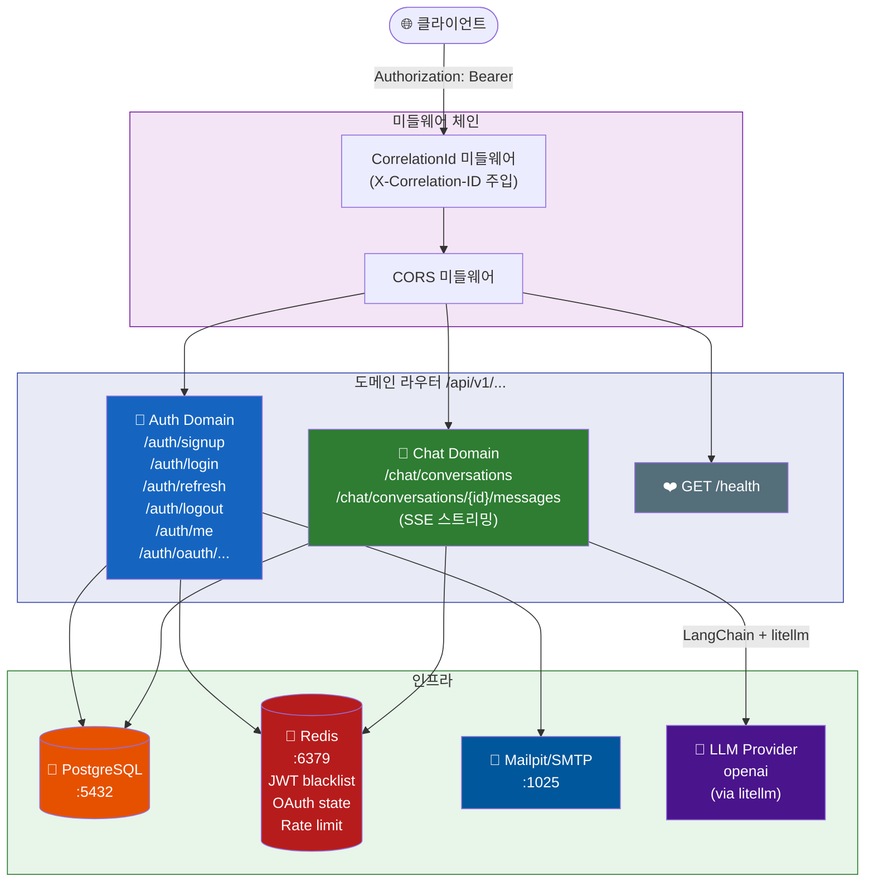
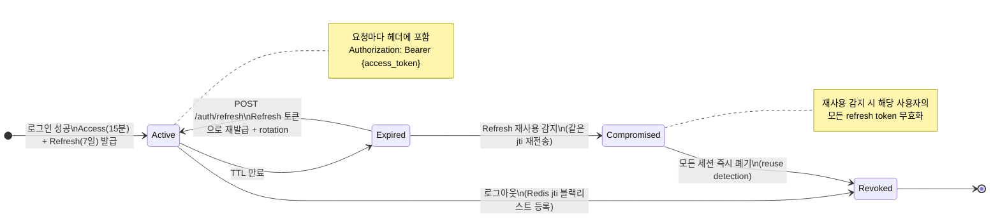
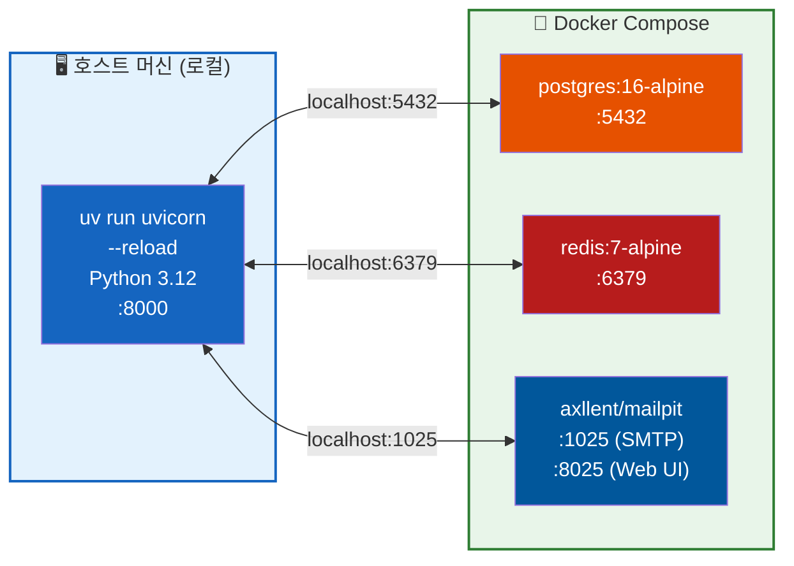
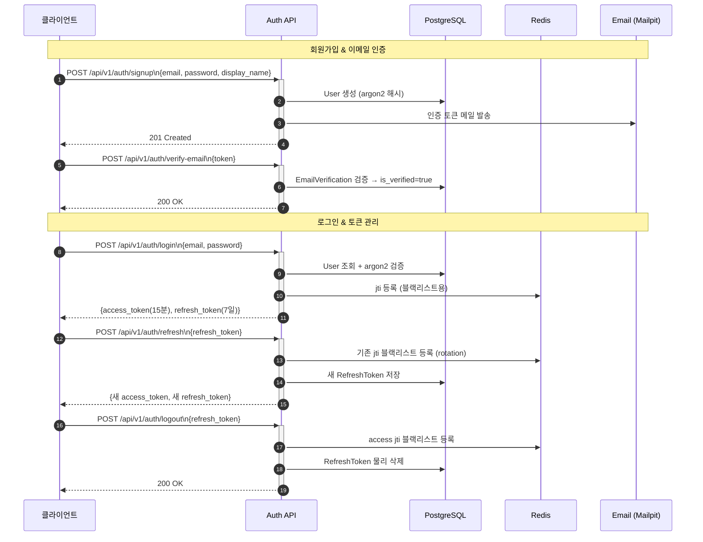
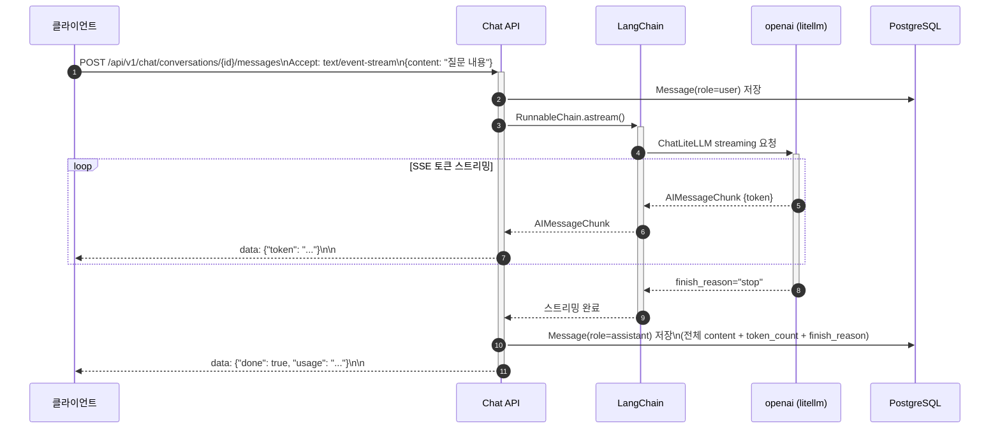

# FastAPI Bootstrap

> Production-grade FastAPI backend with auth (JWT+OAuth+RBAC) and LLM chat proxy domains.

[](https://python.org)
[](https://fastapi.tiangolo.com)
[](https://github.com/astral-sh/uv)
[](https://github.com/astral-sh/ruff)
[](LICENSE)

---

## ⚡ 빠른 시작 (TL;DR — 1분 부팅)

사전 요구사항만 갖춰지면 **한 명령어**로 전체 스택이 기동됩니다.

```bash
# 필수 도구: Docker Desktop + uv + task (없다면 아래 사전 요구사항 섹션 참조)

task dev
```

내부 동작 순서:
1. `uv sync` — Python 의존성 설치 (`.venv` 생성)
2. `docker compose up -d` — PostgreSQL · Redis · Mailpit 컨테이너 기동 + healthy 대기
3. `uv run alembic upgrade head` — DB 스키마 마이그레이션
4. `uv run uvicorn --reload` — FastAPI 개발 서버 시작

기동 후 확인:

```bash
curl http://localhost:8000/health
# → {"status": "ok", "env": "development"}

curl http://localhost:8000/ready
# → {"status":"ready","postgres":"ok","redis":"ok","mailpit":"ok"}
```

| 서비스 | URL |
|--------|-----|
| **Swagger UI** | http://localhost:8000/docs |
| **ReDoc** | http://localhost:8000/redoc |
| **Health** | http://localhost:8000/health |
| **Readiness** (DB/Redis/Mailpit 연결 검증) | http://localhost:8000/ready |
| **Mailpit** (개발 메일함) | http://localhost:8025 |

---

## 목차

- [프로젝트 목적](#프로젝트-목적)
- [기술 스택](#기술-스택)
- [아키텍처](#아키텍처)
- [로컬 개발 환경 부팅](#로컬-개발-환경-부팅)
- [환경변수 목록](#환경변수-목록)
- [디렉토리 구조](#디렉토리-구조)
- [API 문서](#api-문서)
- [테스트 실행](#테스트-실행)
- [코드 품질 도구](#코드-품질-도구)
- [DB 마이그레이션](#db-마이그레이션)
- [로깅](#로깅)
- [Docker 배포 모드 요약](#docker-배포-모드-요약)

---

## 프로젝트 목적

**FastAPI Bootstrap** 은 FastAPI 기반의 Production-grade 백엔드 서버입니다.

- 생성 메타데이터: project slug `fastapi-bootstrap`, public API base `http://localhost:8000`.
- **Light 모듈러 모놀리스 DDD** 구조로 도메인 경계를 명확히 유지합니다.

- **Auth 도메인**: JWT(Bearer) + OAuth(google,kakao,naver) + RBAC 기반의 완전한 인증·인가 시스템을 제공합니다.


- **Chat 도메인**: LangChain + langchain-litellm 기반 LLM 채팅 프록시와 SSE 스트리밍을 지원합니다.

- **uv + docker-compose** 조합으로 로컬 환경을 1분 내에 부팅합니다.

---

## 기술 스택

### 코어 프레임워크

| 분류 | 기술 | 버전 |
|------|------|------|
| 언어 | Python | >= 3.12 |
| 웹 프레임워크 | FastAPI | >= 0.115 |
| ASGI 서버 | Uvicorn | >= 0.30 |
| 패키지 매니저 | uv | latest |

### 데이터 계층

| 분류 | 기술 | 버전 |
|------|------|------|
| ORM | SQLAlchemy (async) | >= 2.0.36 |
| 마이그레이션 | Alembic | >= 1.14 |
| DB 드라이버 | asyncpg | >= 0.30 |
| 데이터베이스 | PostgreSQL | >= 16 |
| 캐시/Pub-Sub | Redis | >= 7 |

### 인증·인가

| 분류 | 기술 |
|------|------|
| JWT | python-jose (cryptography) |
| 비밀번호 해시 | passlib + argon2-cffi |
| OAuth 프로바이더 | google,kakao,naver |
| RBAC | Role + Permission 2테이블 + M:N 조인 |


### LLM / Chat 도메인

| 분류 | 기술 |
|------|------|
| LLM 오케스트레이션 | LangChain >= 0.3 |
| LLM 어댑터 | langchain-litellm >= 0.2 |
| LLM 프로바이더 | openai (litellm 기반 교체 가능) |
| 스트리밍 | sse-starlette |


### 인프라 / 도구

| 분류 | 기술 |
|------|------|
| 로컬 인프라 | docker-compose (postgres / redis / mailpit) |
| 이메일 (dev) | Mailpit (SMTP mock) |
| 이메일 (prod) | SMTP (env 설정) — fastapi-mail |
| 로깅 | structlog (JSON) + correlation_id |
| HTTP 클라이언트 | httpx |

### 코드 품질

| 도구 | 목적 |
|------|------|
| Ruff | 린트 + 포맷 |
| Mypy (strict) | 정적 타입 검사 |
| pytest + pytest-asyncio | 테스트 (async 지원) |
| pre-commit | 커밋 전 자동 검사 |

---

## 아키텍처

**Light Modular Monolith (DDD)** 구조를 채택합니다.
각 도메인은 `domains/<bc>/` 하위에 `router / service / repository / models / schemas` 파일을 갖는 자기 완결적 구조이며, 도메인 간 직접 DB 모델 import는 금지됩니다.

```
domains/
├── auth/                    ← 인증·인가 도메인 (JWT + OAuth + RBAC)
│   ├── router/
│   │   └── auth_router.py   /api/v1/auth/...
│   ├── service/
│   │   └── auth_service.py
│   ├── repository/
│   │   └── auth_repository.py
│   ├── models/
│   │   └── auth_models.py   User, Role, Permission, RefreshToken ...
│   ├── schemas/
│   │   └── auth_schemas.py
│   ├── security.py          JWT + argon2
│   ├── email.py
│   └── oauth/               소셜 로그인 어댑터 (프로바이더별 파일)

└── chat/                    ← LLM 채팅 프록시 도메인
    ├── router/
    │   └── chat_router.py   /api/v1/chat/... (SSE 스트리밍)
    ├── service/
    │   └── chat_service.py  LangChain runnable 오케스트레이션
    ├── repository/
    │   └── chat_repository.py
    ├── models/
    │   └── chat_models.py   Conversation, Message
    └── schemas/
        └── chat_schemas.py
```

### 요청 흐름 (Request Flow)

각 계층에서 도메인별로 분기되어 처리되는 흐름입니다. 미들웨어가 모든 요청에 `correlation_id`를 부여하고 structlog JSON으로 기록합니다.



### JWT 전략

Bearer 헤더 전용(쿠키 미사용)으로 Access Token(15분) + Refresh Token(7일)을 발급합니다.
Refresh rotation과 reuse detection으로 토큰 탈취를 방어합니다.



### 로컬 개발 토폴로지

FastAPI 앱은 **호스트 머신**에서 직접 실행하고, 인프라 서비스만 Docker로 운영합니다.
이 방식으로 hot-reload, IDE 디버거 연결, uv 캐시 활용이 가능합니다.



---

## 로컬 개발 환경 부팅

### 사전 요구사항

| 도구 | 설치 방법 |
|------|-----------|
| Docker Desktop | [docker.com/products/docker-desktop](https://www.docker.com/products/docker-desktop/) |
| uv | `curl -LsSf https://astral.sh/uv/install.sh \| sh` |
| Python >= 3.12 | `uv python install 3.12` |
| task | `brew install go-task` 또는 [taskfile.dev/installation](https://taskfile.dev/installation/) |

### 원클릭 부팅 (권장)

```bash
task dev
```

> `task dev`는 아래 5단계를 **자동으로** 순서대로 실행합니다.

### 단계별 부팅 (수동)

#### 1단계 — 환경변수 설정

```bash
cp .env.example .env
# .env 파일을 열어 아래 필수 값을 설정합니다:
#   SECRET_KEY      → openssl rand -hex 32
#   JWT_SECRET_KEY  → openssl rand -hex 32

#   LLM API 키      → 선택한 provider에 맞는 키 1개

```

#### 2단계 — Python 의존성 설치

```bash
# uv로 가상환경(.venv) 생성 + 의존성 설치 (dev 그룹 포함)
uv sync
```

#### 3단계 — 인프라 컨테이너 기동

```bash
# postgres + redis + mailpit 컨테이너 기동 (healthy 상태까지 대기)
task infra

# 상태 확인
docker compose ps
```

#### 4단계 — DB 마이그레이션

```bash
uv run alembic upgrade head
```

#### 5단계 — 개발 서버 시작

```bash
# hot-reload 활성화 (파일 저장 시 자동 재시작)
uv run uvicorn main:app \
    --host 0.0.0.0 \
    --port 8000 \
    --reload \
    --reload-dir src
```

### 헬스체크 확인

```bash
curl http://localhost:8000/health
# → {"status": "ok", "env": "development"}
```

### 메일 확인 (Mailpit)

브라우저에서 `http://localhost:8025` 접속 → 회원가입 인증 메일 등을 확인할 수 있습니다.

### 로컬 개발 실행 원칙

`docker-compose.yml`은 로컬 개발 인프라(`postgres`, `redis`, `mailpit`)만 정의합니다. FastAPI 앱은 컨테이너가 아니라 호스트에서 `uv run uvicorn ... --reload`로 실행해야 IDE 디버깅, uv 캐시, hot reload가 빠르게 동작합니다.

```bash
# 권장: infra + migration + host-run FastAPI hot reload
task dev
```

### Production 모드 (`--profile prod`)

`docker-compose.prod.yml` 오버레이를 사용하면 프로덕션 환경을 구성할 수 있습니다.

**특징**:
- `restart: always` — 장애 시 자동 재시작
- `env_file: .env.prod` — 시크릿 파일 분리 (`.env`와 별도)
- `volumes: []` — dev 전용 소스코드 볼륨 마운트 없음
- Mailpit 제외 — 실제 SMTP 서버 사용
- multi-stage Dockerfile `--target runtime` 적용

```bash
# 1. 프로덕션 환경변수 파일 생성
cp .env.prod.example .env.prod
# 시크릿 생성 및 SMTP/DB 자격증명 입력
openssl rand -hex 32   # → SECRET_KEY
openssl rand -hex 32   # → JWT_SECRET_KEY

# 2. (최초 배포) 마이그레이션 실행
task prod-migrate

# 3. 프로덕션 스택 기동 (postgres + redis + app)
task prod-up

# 4. 헬스체크
task prod-health
# → {"status": "ok", "env": "production"}

# 이미지 단독 빌드
task prod-build

# 로그 확인
task prod-logs

# 스택 종료
task prod-down
```

> **보안 주의사항**:
> - `.env.prod`는 절대 버전 관리에 포함하지 마세요 (`.gitignore`에 자동 추가됨)
> - `SECRET_KEY`와 `JWT_SECRET_KEY`는 반드시 별개의 강력한 랜덤 값을 사용하세요
> - `APP_ENV=production`, `APP_DEBUG=false`는 오버레이에서 자동 설정됩니다

### Taskfile 주요 명령어

```bash
# 전체 명령어 목록
task

# 개발
task dev          # 풀 부트스트랩 (권장) ← install + infra + migrate + uvicorn
task serve        # 서버만 재시작 (infra 이미 실행 중일 때)
task infra        # docker-compose up -d (infra only, healthy 대기)
task infra-down   # docker-compose down
task migrate      # alembic upgrade head

# 테스트 & 품질
task test         # pytest (전체)
task lint         # ruff check + mypy
task format       # ruff format + ruff check --fix
task clean        # 빌드 캐시 정리

# 프로덕션
task prod-up      # 프로덕션 스택 기동 (postgres + redis + app)
task prod-down    # 프로덕션 스택 종료
task prod-logs    # 프로덕션 로그 스트리밍
task prod-build   # 프로덕션 이미지 빌드 (--target runtime)
task prod-migrate # 프로덕션 컨테이너에서 Alembic 마이그레이션 실행
```

---

## 환경변수 목록

`.env.example` 파일을 복사해 `.env`를 만들고 아래 항목을 채워야 합니다.

### 필수 변경 항목 (빠른 참조)

```bash
# 서버 기동 전 반드시 변경
SECRET_KEY=<openssl rand -hex 32>
JWT_SECRET_KEY=<openssl rand -hex 32>   # SECRET_KEY와 다른 값 사용

# LLM 프로바이더 키 (선택한 provider 1개만 설정)
OPENAI_API_KEY=sk-...


```

### 앱 기본 설정

| 변수 | 기본값 | 설명 |
|------|--------|------|
| `APP_ENV` | `development` | 실행 환경 (`development` / `staging` / `production`) |
| `APP_DEBUG` | `false` | 디버그 모드 — 기본값은 안전하게 비활성화 |
| `SECRET_KEY` | *(필수 변경)* | 앱 시크릿 키 — 최소 32바이트 랜덤 |
| `FRONTEND_URL` | `http://localhost:3000` | 로컬 프론트엔드 기본 URL |
| `CORS_ORIGINS` | `["http://localhost:3000","http://localhost:8000"]` | CORS 허용 오리진 (JSON 배열 또는 `,` 구분) |
| `HOST` | `0.0.0.0` | Uvicorn 바인드 호스트 |
| `PORT` | `8000` | Uvicorn 포트 |
| `WORKERS` | `1` | Uvicorn worker 수 — 로컬 기본값 1 |

### 데이터베이스

| 변수 | 기본값 | 설명 |
|------|--------|------|
| `POSTGRES_HOST` | `localhost` | PostgreSQL 호스트 |
| `POSTGRES_PORT` | `5432` | PostgreSQL 포트 |
| `POSTGRES_USER` | `app` | DB 사용자 |
| `POSTGRES_PASSWORD` | `app` | DB 비밀번호 |
| `POSTGRES_DB` | `app_db` | DB 이름 |
| `DATABASE_URL` | *(자동 조합)* | `postgresql+asyncpg://...` (명시 시 우선 적용) |
| `DATABASE_URL_SYNC` | *(자동 조합)* | `postgresql+psycopg2://...` (Alembic용) |

### Redis

| 변수 | 기본값 | 설명 |
|------|--------|------|
| `REDIS_HOST` | `localhost` | Redis 호스트 |
| `REDIS_PORT` | `6379` | Redis 포트 |
| `REDIS_DB` | `0` | Redis DB 번호 |
| `REDIS_URL` | *(자동 조합)* | `redis://...` (명시 시 우선 적용) |

### JWT / 인증

| 변수 | 기본값 | 설명 |
|------|--------|------|
| `JWT_SECRET_KEY` | *(필수 변경)* | JWT 서명 키 — SECRET_KEY와 다른 값 사용 |
| `JWT_ALGORITHM` | `HS256` | JWT 서명 알고리즘 |
| `JWT_ACCESS_TOKEN_EXPIRE_MINUTES` | `15` | Access Token TTL (분) |
| `JWT_REFRESH_TOKEN_EXPIRE_DAYS` | `7` | Refresh Token TTL (일) |


### OAuth 프로바이더


**Google OAuth** ([설정 콘솔](https://console.cloud.google.com/apis/credentials))

| 변수 | 설명 |
|------|------|
| `GOOGLE_CLIENT_ID` | Google OAuth Client ID |
| `GOOGLE_CLIENT_SECRET` | Google OAuth Client Secret |
| `GOOGLE_REDIRECT_URI` | `http://localhost:8000/api/v1/auth/oauth/google/callback` |


**Kakao OAuth** ([설정 콘솔](https://developers.kakao.com/console/app))

| 변수 | 설명 |
|------|------|
| `KAKAO_CLIENT_ID` | Kakao REST API 키 |
| `KAKAO_CLIENT_SECRET` | Kakao Client Secret (선택) |
| `KAKAO_REDIRECT_URI` | `http://localhost:8000/api/v1/auth/oauth/kakao/callback` |


**Naver OAuth** ([설정 콘솔](https://developers.naver.com/apps/#/list))

| 변수 | 설명 |
|------|------|
| `NAVER_CLIENT_ID` | Naver Client ID |
| `NAVER_CLIENT_SECRET` | Naver Client Secret |
| `NAVER_REDIRECT_URI` | `http://localhost:8000/api/v1/auth/oauth/naver/callback` |


### 이메일

| 변수 | 기본값 | 설명 |
|------|--------|------|
| `MAIL_SERVER` | `localhost` | SMTP 서버 (dev: mailpit) |
| `MAIL_PORT` | `1025` | SMTP 포트 |
| `MAIL_USERNAME` | *(선택)* | SMTP 사용자 |
| `MAIL_PASSWORD` | *(선택)* | SMTP 비밀번호 |
| `MAIL_FROM` | `noreply@fastapi-bootstrap.example.com` | 발신 이메일 주소 |
| `MAIL_STARTTLS` | `false` | STARTTLS (prod: `true`) |
| `MAIL_SSL_TLS` | `false` | SSL/TLS (prod: `true`) |


### LLM / Chat 도메인

| 변수 | 기본값 | 설명 |
|------|--------|------|
| `LLM_PROVIDER` | `openai` | LLM 프로바이더 (`openai` / `anthropic` / `gemini` / `azure` / `ollama`) |
| `LLM_DEFAULT_MODEL` | `gpt-4o-mini` | 기본 모델 이름 |
| `LLM_TEMPERATURE` | `0.7` | 샘플링 온도 (`0.0`–`2.0`) |
| `LLM_MAX_TOKENS` | `2048` | 응답당 최대 생성 토큰 수 |
| `LLM_STREAMING` | `true` | SSE 토큰 스트리밍 기본 활성화 여부 |
| `OPENAI_API_KEY` | — | `LLM_PROVIDER=openai` 시 필수 |
| `ANTHROPIC_API_KEY` | — | `LLM_PROVIDER=anthropic` 시 필수 |
| `GEMINI_API_KEY` | — | `LLM_PROVIDER=gemini` 시 필수 |
| `AZURE_OPENAI_API_KEY` | — | `LLM_PROVIDER=azure` 시 필수 |
| `AZURE_OPENAI_ENDPOINT` | — | Azure OpenAI endpoint URL |
| `AZURE_OPENAI_API_VERSION` | `2024-08-01-preview` | Azure OpenAI API 버전 |
| `OLLAMA_BASE_URL` | `http://localhost:11434` | `LLM_PROVIDER=ollama` 시 사용 (키 불필요) |

> **LLM 프로바이더 교체**: `LLM_PROVIDER` 값과 해당 API 키 환경변수만 변경하면 됩니다. **코드 수정 불필요.**


### 로깅

| 변수 | 기본값 | 설명 |
|------|--------|------|
| `LOG_LEVEL` | `INFO` | 로그 레벨 (`DEBUG` / `INFO` / `WARNING` / `ERROR` / `CRITICAL`) |
| `LOG_FORMAT` | `json` | 출력 형식 (`json` / `console`) |

---

## 디렉토리 구조

```
fastapi-bootstrap/
│
├── src/                                          # Python path 루트 (PYTHONPATH=src)
│   ├── main.py                                   # FastAPI app 팩토리 + 라이프사이클
│   ├── __main__.py                               # python -m 실행 진입점
│   │
│   ├── core/                                     # 횡단 관심사 (도메인 무관 공통 코드)
│   │   ├── config.py                             # Pydantic Settings (env 로딩)
│   │   ├── database.py                           # SQLAlchemy async engine / session
│   │   ├── redis.py                              # Redis 커넥션 풀
│   │   ├── middleware.py                         # correlation_id + structlog 미들웨어
│   │   └── exceptions.py                         # 공통 HTTPException 핸들러
│   │
│   ├── domains/                                  # DDD Bounded Contexts
│   │   ├── auth/                                 # 인증·인가 도메인
│   │   │   ├── router/
│   │   │   │   └── auth_router.py               # /api/v1/auth/ 엔드포인트
│   │   │   ├── service/
│   │   │   │   └── auth_service.py              # 비즈니스 로직
│   │   │   ├── repository/
│   │   │   │   └── auth_repository.py           # DB 쿼리 (User, RefreshToken 등)
│   │   │   ├── models/
│   │   │   │   └── auth_models.py               # SQLAlchemy ORM 모델
│   │   │   ├── schemas/
│   │   │   │   └── auth_schemas.py              # Pydantic 요청/응답 스키마
│   │   │   ├── security.py                      # JWT encode/decode, argon2 해시
│   │   │   ├── email.py                         # 이메일 발송 서비스
│   │   │   └── oauth/                           # OAuth 어댑터 (프로바이더별 파일)
│   │   │       ├── google.py
│   │   │       ├── kakao.py
│   │   │       └── naver.py
│   │   │
│   │   ├── chat/                                 # LLM 채팅 프록시 도메인
│   │   │   ├── router/
│   │   │   │   └── chat_router.py               # /api/v1/chat/ 엔드포인트 (SSE)
│   │   │   ├── service/
│   │   │   │   └── chat_service.py              # LangChain runnable 오케스트레이션
│   │   │   ├── repository/
│   │   │   │   └── chat_repository.py           # Conversation / Message DB 쿼리
│   │   │   ├── models/
│   │   │   │   └── chat_models.py               # SQLAlchemy ORM 모델
│   │   │   ├── schemas/
│   │   │   │   └── chat_schemas.py              # Pydantic 요청/응답 스키마
│   │   │   ├── llm_client.py
│   │   │   ├── llm_factory.py
│   │   │   ├── container.py
│   │   │   └── ports.py
│   │   │
│   │   └── shared/                              # 도메인 공유 기반 코드
│   │       ├── base.py
│   │       ├── events.py
│   │       └── types.py
│   │
│   └── infra/                                    # 외부 시스템 어댑터
│       └── llm/
│           └── provider_factory.py
│
├── tests/                                        # pytest 테스트
│   ├── conftest.py                               # 공통 fixture (DB, Redis, 앱 클라이언트)
│   ├── auth/                                     # Auth 도메인 통합 테스트
│   └── chat/                                     # Chat 도메인 통합 테스트
│
├── alembic/                                      # DB 마이그레이션
│   ├── env.py                                    # async 마이그레이션 설정
│   └── versions/                                 # 생성된 마이그레이션 파일들
│
├── scripts/                                      # 유틸리티 스크립트
│   └── smoke_test.py                             # API 기동 검증 스크립트
│
├── docker-compose.yml                            # 로컬 인프라 전용 (postgres / redis / mailpit)
├── docker-compose.prod.yml                       # 프로덕션 app 컨테이너 오버레이
├── Dockerfile                                    # 멀티스테이지 프로덕션 이미지 (uv 기반)
├── .env.example                                  # 환경변수 템플릿
├── alembic.ini                                   # Alembic 설정
├── pyproject.toml                                # 프로젝트 메타데이터 + 도구 설정
├── Taskfile.yml                                  # 개발 편의 명령어 (task dev 등)
└── .pre-commit-config.yaml                       # pre-commit 훅 (ruff + mypy)
```

---

## API 문서

개발 서버 실행 후 브라우저에서 접근:

- **Swagger UI**: http://localhost:8000/docs
- **ReDoc**: http://localhost:8000/redoc
- **OpenAPI JSON**: http://localhost:8000/openapi.json

### 주요 엔드포인트

#### Auth 도메인 흐름

회원가입부터 로그아웃까지의 전체 인증 흐름입니다. 각 단계는 순서대로 실행되어야 합니다.



#### Auth API 엔드포인트 목록

| Method | Path | 설명 |
|--------|------|------|
| `POST` | `/api/v1/auth/signup` | 이메일 회원가입 |
| `POST` | `/api/v1/auth/verify-email` | 이메일 인증 |
| `POST` | `/api/v1/auth/login` | 로그인 (Access + Refresh 토큰 발급) |
| `POST` | `/api/v1/auth/refresh` | Access 토큰 갱신 (Refresh rotation) |
| `POST` | `/api/v1/auth/logout` | 로그아웃 (Refresh 토큰 폐기) |
| `POST` | `/api/v1/auth/password/reset-request` | 비밀번호 재설정 요청 |
| `POST` | `/api/v1/auth/password/reset` | 비밀번호 재설정 |
| `GET`  | `/api/v1/auth/me` | 내 정보 조회 |

| `GET`  | `/api/v1/auth/oauth/google/authorize` | Google OAuth 시작 |
| `GET`  | `/api/v1/auth/oauth/google/callback` | Google OAuth 콜백 |


| `GET`  | `/api/v1/auth/oauth/kakao/authorize` | Kakao OAuth 시작 |
| `GET`  | `/api/v1/auth/oauth/kakao/callback` | Kakao OAuth 콜백 |


| `GET`  | `/api/v1/auth/oauth/naver/authorize` | Naver OAuth 시작 |
| `GET`  | `/api/v1/auth/oauth/naver/callback` | Naver OAuth 콜백 |


#### Chat 도메인 — SSE 스트리밍 흐름

메시지 전송 시 `Accept: text/event-stream` 헤더를 포함하면 LLM 응답이 토큰 단위로 스트리밍됩니다.



#### Chat API 엔드포인트 목록

| Method | Path | 설명 |
|--------|------|------|
| `GET`  | `/api/v1/chat/conversations` | 대화 목록 조회 |
| `POST` | `/api/v1/chat/conversations` | 새 대화 생성 |
| `GET`  | `/api/v1/chat/conversations/{id}` | 대화 상세 조회 |
| `DELETE` | `/api/v1/chat/conversations/{id}` | 대화 삭제 |
| `GET`  | `/api/v1/chat/conversations/{id}/messages` | 메시지 목록 |
| `POST` | `/api/v1/chat/conversations/{id}/messages` | 메시지 전송 (SSE 스트리밍) |


---

## 테스트 실행

```bash
# 전체 테스트 (커버리지 포함)
uv run pytest

# Taskfile 단축키
task test              # 전체 테스트
task test-unit         # 단위 테스트만 (-m unit)
task test-integration  # 통합 테스트만 (-m integration, infra 필요)
task test-cov          # 커버리지 HTML 리포트 (htmlcov/index.html)

# 특정 파일
uv run pytest tests/auth/test_auth_flow.py -v
```

> 통합 테스트 실행 전 `docker compose up -d`로 postgres와 redis가 기동되어 있어야 합니다.

---

## 코드 품질 도구

```bash
# 린트 (ruff check)
uv run ruff check src/ tests/

# 포맷 (ruff format)
uv run ruff format src/ tests/

# 린트 + 자동 수정
uv run ruff check --fix src/ tests/

# 타입 검사 (mypy strict)
uv run mypy src/

# 전체 품질 검사 (Taskfile)
task lint      # ruff check + mypy
task format    # ruff format + ruff check --fix


# pre-commit 설치 (최초 1회)
uv run pre-commit install

# 수동 실행 (전체 파일)
uv run pre-commit run --all-files

```

---

## DB 마이그레이션

```bash
# 현재 상태 확인
uv run alembic current

# 최신 마이그레이션 적용
uv run alembic upgrade head

# 새 마이그레이션 파일 생성 (모델 변경 후)
uv run alembic revision --autogenerate -m "add_new_field"

# 한 단계 롤백
uv run alembic downgrade -1

# 특정 리비전으로 롤백
uv run alembic downgrade <revision_id>

# Taskfile 단축키
task migrate          # alembic upgrade head
task revision         # 새 revision 생성 (메시지 입력 프롬프트)
task downgrade        # 한 단계 롤백
```

> 마이그레이션 파일은 항상 코드 리뷰를 거쳐 커밋합니다. autogenerate로 생성된 SQL을 반드시 검토하세요.

---

## 로깅

모든 로그는 **structlog JSON** 형식으로 출력되며, 각 요청에 `correlation_id`가 자동으로 부여됩니다.
`LOG_FORMAT=console`로 설정하면 개발 중 사람이 읽기 편한 형식으로 출력됩니다.

```json
{
  "timestamp": "2024-01-01T00:00:00Z",
  "level": "info",
  "event": "request_finished",
  "correlation_id": "550e8400-e29b-41d4-a716-446655440000",
  "method": "POST",
  "path": "/api/v1/auth/login",
  "status_code": 200,
  "duration_ms": 45
}
```

---

## 라이선스

MIT — [Your Name](mailto:you@example.com)
